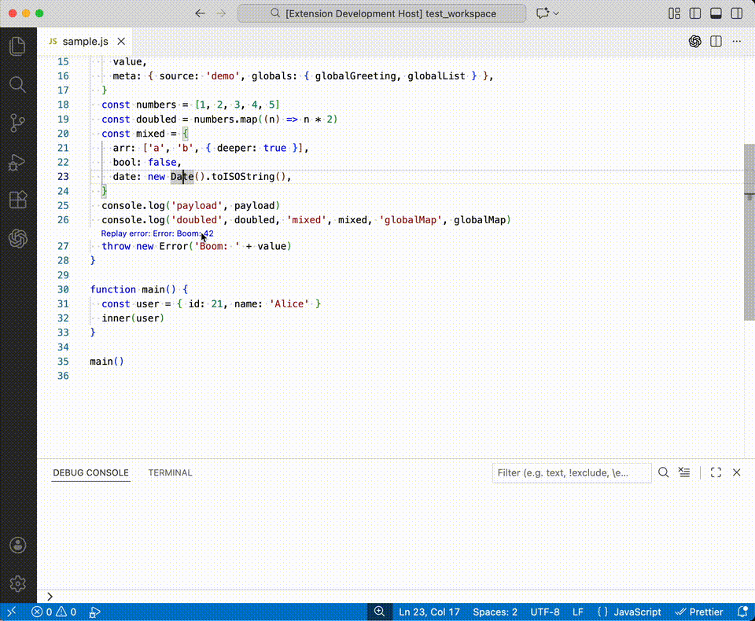

# Error Replay Debug Adapter (PoC)

Prototype VS Code debug adapter that replays post-mortem errors through the native debug UI (Call Stack, Variables, restart frame, breakpoints). There is no live engine: the adapter consumes a simple async API that loads a stack trace and lazily loads variables per frame.

This PoC explores replaying ESP32 crashes by decoding backtraces/coredumps with [ESP Exception Decoder](https://github.com/dankeboy36/esp-exception-decoder) and its [TraceBreaker](https://github.com/dankeboy36/trbr) engine, while borrowing ideas from Datadog Exception Replay ([VS Code plugin](https://docs.datadoghq.com/developers/ide_plugins/vscode/#exception-replay), [tracing docs](https://docs.datadoghq.com/tracing/error_tracking/exception_replay/)).

## Packages

- [`adapter`](packages/adapter/README.md): generic inline debug adapter (includes shared types) fed by your data source.
- [`mock`](packages/mock/README.md): mock generator that captures a Node script at the first uncaught exception.
- [`extension`](packages/extension/README.md): sample VS Code extension wiring the adapter and mock data.

## Quick start

- Clone, open in VS Code, then `npm install`.
- Open Debug view (<kbd>Ctrl/⌘</kbd>+<kbd>Shift</kbd>+<kbd>D</kbd>), choose the `Run Extension` config, and start (<kbd>F5</kbd>).
- In the test workspace, run the `Error Replay: Generate Mock Error` command, pick a sample JS module (or any JS that throws soon), and wait for the JSON fixture to be generated.
- Generated fixtures land in `fixtures/generated/` under your workspace; a CodeLens will appear at the error line once the file is created.
- A CodeLens appears at the error location: click it to replay. The debugger stops just before the error; restart frame to walk earlier frames. Continue jumps to the next recorded frame or breakpoint; step in/out are no-ops; evaluation is unsupported but you can watch variables, scopes, and frame metadata. If multiple errors exist for one location, you’ll pick via Quick Pick.

## Notes

> [!NOTE]
> Stepping moves across recorded frames; restart frame is supported. Evaluate/setVariable are intentionally not supported—this is a replay, not a live debugger.

- Variables are fetched lazily per snapshot; frames can be deemphasized via skip globs.
- See each package README for details and API surface.
