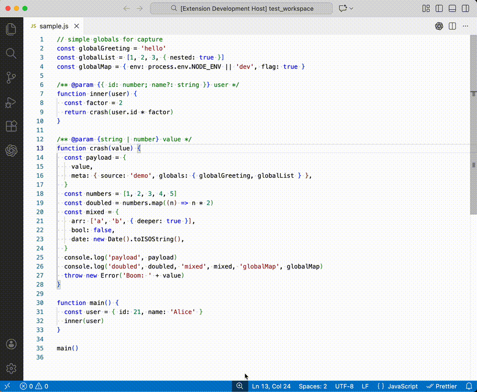

# @error-replay/extension

VS Code extension that wires the error replay adapter for interactive testing.

## Features

- Inline debug adapter (`error-replay` debug type) that renders recorded stack frames and variables.
- CodeLens on error locations to launch a replay directly from source.
- Command `Error Replay: Open File` to pick a replay JSON; default to `fixtures/replay.json` if present.
- Command `Error Replay: Generate Mock Error` to run the mock harvester and generate fixtures into `fixtures/generated/`.
  

## Running

1. `npm install`
2. `npm run bundle` (webpack) or `npm run build` for TS only.
3. Launch “Run Extension” in VS Code; use the `Error Replay` launch config or CodeLens to start.

## Notes

- [!WARNING]
  This adapter does not evaluate expressions or mutate variables; it replays recorded snapshots only.
- Variables load lazily per frame; restart frame is supported; step-in is disabled; continue/next work across recorded frames.
